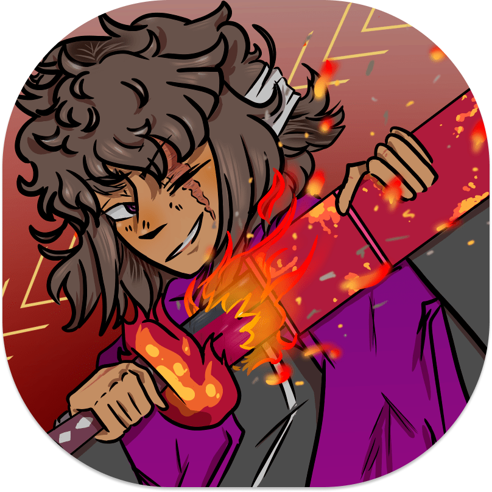
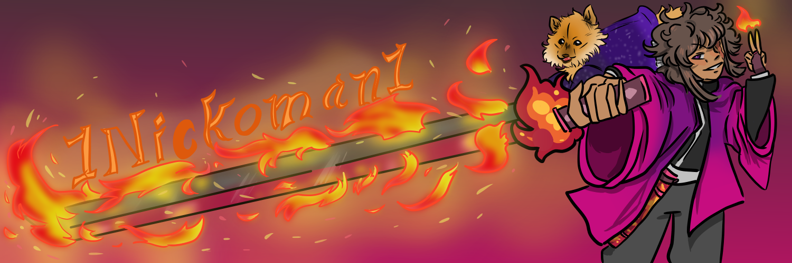

<!-- Header Section with the PFP made by Float Nick's Artist -->

    

<!-- Social icons section -->

    
    
    
    

    

<!-- Typing SVG by DenverCoder1 - https://github.com/DenverCoder1/readme-typing-svg -->

    <h3></h3>

<!-- Body Section with the BAnner made by Float Nick's Artist -->

    

        
    

    <h2> :man_technologist: About Me : <h3>
        

        - I am Nick aka Aaron or Nicolas! Im highschool student who is learning alot of things all at once! My pronouns are He/They.
        - I will be posting some of my programs I learned in path of becoming a Content Creator and Programmer.
        - In my freetime play minecraft alot and learn how to changing things in minecraft with mods, plugins, datapacks, resourcepacks.
        - As you see idk how to make this about me very welll!
        - Well here is my socials 
        

    <h3> 📘 Open source projects : </h3>
    

        
        
        
        
    

    <h3> 🛠️ My favorite tools :  </h3>
        

            <h2> 👨‍💻 Programs and languages I used (Or going to learn how to use) : </h2>
                

                    
                    
                    
                    
                    
                    
                    
                    
                    
                    
                    
                    <a href="">
                

            <h2> 🗄️ Databases and cloud hosting I used (Or going to learn how to use) : </h2>
                

                    
                    
                    
                    
                    
                

            <h2> 💻 Software and tools I used (Or going to learn how to use) : </h2>
            

                
                

                    
                    
                    
                    
                    
                    
                

                
                

                    
                    
                    
                

                
                
                
                
                
                
                
                
                
                
                
            

        

    <h3> 📺 Latest YouTube videos </h3>
    <!-- Feed workflow  -->
    <!-- YouTube Cards -->
    <!-- YOUTUBE:START -->
        

        

    <h3> 💻 GitHub Profile Stats </h3>
        

            
 
                
💻 GitHub Profile Stats

                     
                        
                        
                        
                     
                <b>Note:</b> Top languages is only a metric of the languages my public code consists of and doesn't reflect experience or skill level.
            

            

                
⚡ Recent GitHub Activity

                     
                    <!--START_SECTION:activity-->
                    1. ❗️Setting up environments for [minecraft plugin](https://github.com/NickOman-Corps/NickOman-Ess) in [NickOman Corps](https://github.com/NickOman-Corps) project.
                    2. ❗️Setting up environments for [minecraft forge mod](https://github.com/NickOman-Corps/NickOman-BlockieForgeMod) in [NickOman Corps](https://github.com/NickOman-Corps) project.
                    3. ❗️Setting up environments for [minecraft datapack](https://github.com/NickOman-Corps/NickOman-Datapack) in [NickOman Corps](https://github.com/NickOman-Corps) project.
                    <!--END_SECTION:activity-->
            

        <!-- https://github.com/ashutosh00710/github-readme-activity-graph -->
        
        

